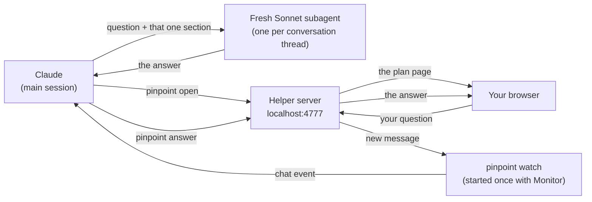

# Pinpoint

When you ask Claude Code for a plan, Pinpoint opens it as a page in your browser instead of a wall of text: the goal, how the code works today, two to four ways to build it (each with a diagram, a cost and one marked recommended), and the risks and open questions.

Click any part of the page to ask about it. Claude answers on that card only and the rest of the page stays as it was. Everything runs on your machine.

## Use it in Claude Code

You need [Bun](https://bun.sh) 1.3 or newer (or run `mise install` in this folder).

**1. Clone and install**

```sh
git clone https://github.com/MatveyDidenko/pinpoint-planner.git
cd pinpoint-planner
bun install
```

**2. Install the skill**

```sh
bun bin/pinpoint.ts skill --install
```

This writes `~/.claude/skills/pinpoint/SKILL.md`, so every Claude Code session can use Pinpoint. The file points at this folder, so run the command again if you move the folder, update Bun, or pull new changes.

**3. Ask for a plan**

Start a new Claude Code session in any project and ask for a plan:

```
use pinpoint to plan adding token refresh to the API client
```

or type `/pinpoint` followed by the request. Claude reads the code, writes the plan and opens it in your browser. The first time, Claude Code may ask to allow the Monitor tool; that is how Claude hears your clicks, so allow it.

**4. Work through the page**

- Click a card, or select text in it, to ask about it. Click a `GUESS` step or a `QUESTION` to answer it.
- Press **Edit diagram** to move or change boxes, then **Ask about my version**.
- Press **Choose this way** and Claude writes the step-by-step list for it.
- Press **Hand back to agent** when you are done; Claude carries on in the chat with what you chose.

## How it works



- `pinpoint open` starts the helper if it is not running. The helper is one small server on `127.0.0.1:4777` that serves the page, saves plans in `~/.pinpoint` and stops after 30 idle minutes.
- `pinpoint watch` prints one line for each thing you do in the page, and Claude Code turns each line into a message for Claude.
- Claude replies with `pinpoint answer`, `append-steps` or `patch-block`, which change one card only.

The full design is in [docs/design.md](docs/design.md).

## Develop

In the commands below, `pinpoint` means `bun bin/pinpoint.ts`.

```sh
bun test                # unit, http and cli tests, with a 90% coverage gate
bun run setup:e2e       # once: installs Chromium for the browser tests
bun run test:e2e        # browser tests; the visual baselines only match on macOS
bun run verify          # lint, typecheck, tests, skill check and browser tests
```

Try the page without Claude:

```sh
bun run demo                          # opens a sample plan
bun run demo:agent -- auth-refresh    # in a second terminal: a scripted agent answers you
```

The helper that `pinpoint open` starts keeps running the code it started with. After editing, run `pinpoint stop` so the next command starts a fresh one, or run `bun run dev` to keep a helper in the foreground that restarts on save. If anything misbehaves, read `~/.pinpoint/helper.log`.

| Variable | Default | Meaning |
|---|---|---|
| `PINPOINT_PORT` | `4777` | Helper port on 127.0.0.1 |
| `PINPOINT_STATE_DIR` | `~/.pinpoint` | Saved plans and `helper.log` |
| `PINPOINT_NO_OPEN` | unset | `1` skips opening the browser |
| `PINPOINT_IDLE_TIMEOUT_MS` | `1800000` | Helper stops after this long with nothing to do |
| `PINPOINT_POLL_MAX_WAIT_MS` | `1500000` | Longest one wait on the helper lasts |
| `PINPOINT_BROWSER_GRACE_MS` | `90000` | How long a closed tab is tolerated |
| `PINPOINT_INVOCATION` | detected | Command prefix written into the skill and `next_step` |
